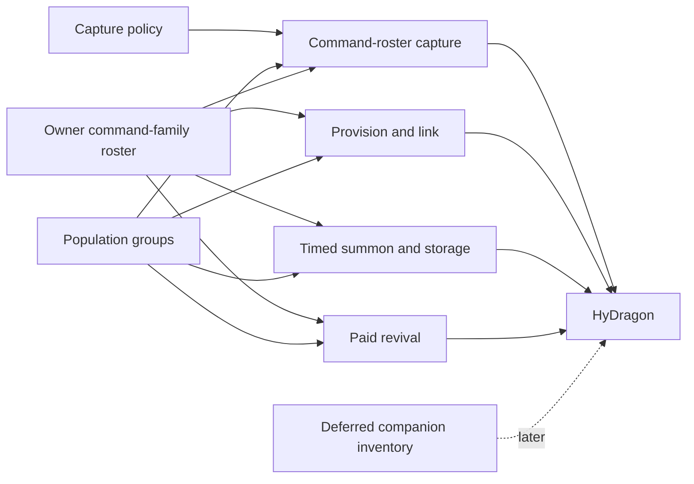

# HyDragon Enablement Specifications

Status: Command-roster redesign specified; implementation pending
Target: Tamework 3.x
Consumer: HyDragon `>=3.0.0 <4.0.0`

## 1. Direction

Tamework supplies content-neutral systems required by HyDragon: authoritative capture probability, owner/population admission, canonical profiles, command-family rosters, configurable active limits, timed summoning/storage, idempotent provisioning, generic paid command revival, and public integration capabilities. HyDragon supplies dragons, stones, the Dragon Horn and Wyvern Egg assets, balance, abilities, encounters, and presentation.

The unreleased bonded-vessel design is withdrawn. Draconic Stones are consumable attempts; an eligible roll spends one stone on success or failure. Success tames the existing NPC in place and adds its canonical profile to the owner's Dragon Horn roster. Death preserves that row and paid revival restores the same profile.

## 2. Fixed integration decisions

- HyDragon targets Tamework `>=3.0.0 <4.0.0` and uses granular capability checks.
- Existing Tamework spawner behavior remains compatible unless a config opts into new capture fields.
- `SourceConsumption: ResolvedAttempt` consumes one source item on either terminal roll result.
- `SuccessDisposition: TameAndCommandLink` keeps the target in the world and commits command-family membership.
- Preflight denial and cancellation do not roll or consume.
- Command family `hydragon:dragon_horn` is durable per owner/profile. Physical Horn metadata is not authority.
- Full dragons and Miniwyverns use the same Horn roster with distinct data-driven population groups and per-profile summon leases.
- The Wyvern Egg uses provision-and-link and creates no separate Soul Bound Wyvern item.
- Summon expiry or Dismiss durably snapshots/despawns the projection into `ROSTER_STORED`, releases active capacity, and starts a configured cooldown. Recall and restart do not reset the timer.
- Revival costs are ordered multi-component item lists. Item IDs and quantities are entirely data-driven; future consumers may use Life Essence or unrelated currencies.
- The linked-panel confirmation clearly displays every cost component and owned/required quantity before payment.
- Recall and revival prefer safe placement in front of the player.
- Miniwyverns remain excluded from ordinary capture.
- The backpack remains deferred.
- Tamework removes its bonded-vessel subsystem. HyDragon needs no migration because it has never shipped.

## 3. Documents

| Specification | Tamework responsibility | HyDragon counterpart |
| --- | --- | --- |
| [Capture policy](capture-policy.md) | Eligibility, power/resistance formula, exactly-once result, cooldown, attempt journal | [Capture and Dragon Horn](https://github.com/Alechilles/HyDragon/blob/main/docs/specs/capture-summoning-maintenance.md) |
| [Command-roster capture, timed summoning, and paid revival](command-roster-capture-revival.md) | Spend-on-roll, tame-in-place finalizer, owner-family roster, active cap, summon lease/storage, provision-and-link, generic multi-item revival, vessel removal | [Capture and Dragon Horn](https://github.com/Alechilles/HyDragon/blob/main/docs/specs/capture-summoning-maintenance.md) and [Miniwyvern](https://github.com/Alechilles/HyDragon/blob/main/docs/specs/soul-bond-miniwyvern.md) |
| [Population groups](population-groups.md) | Per-owner owned/active limits and recovery admission | HyDragon capture and Miniwyvern specs |
| [Integration contract](integration-contract.md) | Capability/version boundary, transaction ownership, event ordering, diagnostics | [Plugin architecture](https://github.com/Alechilles/HyDragon/blob/main/docs/specs/plugin-architecture.md) |
| Deferred: [Companion inventory](companion-inventory.md) | Later profile-scoped Miniwyvern backpack | [Miniwyvern](https://github.com/Alechilles/HyDragon/blob/main/docs/specs/soul-bond-miniwyvern.md) |

HyDragon's suite begins at its [specification index](https://github.com/Alechilles/HyDragon/blob/main/docs/specs/README.md).

## 4. Responsibility boundary

### Tamework adds or changes

- Generic source-item consumption policies for resolved capture attempts.
- An in-place tame-and-command-link success disposition.
- Durable owner/command-family/profile roster membership behind command access items.
- Data-driven population-group active caps across every projection path.
- Per-profile Summon/Dismiss leases, `ROSTER_STORED`, expiry warnings, cooldowns, and restart-safe storage.
- Provision-and-link for special companion acquisition.
- Reusable multi-component item costs and exact inventory payment/refund for command-panel revival.
- In-front-first safe placement for Recall and Revive.
- Granular public capabilities, immutable views/results/events, recovery, diagnostics, and tests.
- Removal of all bonded-vessel surfaces.

### HyDragon implements

- Five Draconic Stone assets, recipes, capture values, role allowlists, and feedback.
- Dragon Horn and Wyvern Egg assets/configuration/acquisition.
- Full-dragon and Miniwyvern population-group limits plus role-scoped summon durations/cooldowns.
- Arbitrary revival cost components by role/difficulty, initially using HyDragon content items.
- Soul Bond entitlement, elemental archetypes/abilities, Altar/economy, and encounters.
- English, Brazilian Portuguese, German, French, and Spanish player-facing catalogs.
- Removal of filled/damaged stone states, stone repair, Soul Bound Wyvern, and bonded runtime code.

### Explicit Tamework non-goals

- No hardcoded HyDragon item, role, family, group, material, or lore IDs.
- No dragon-specific chance curve, revival price, ability, encounter, or presentation logic.
- No compatibility reader or migration for unreleased HyDragon data.
- No backpack in this delivery.
- No best-effort positive mutation when profile, inventory, population, or persistence authority is unavailable.

## 5. Dependency graph

## 6. Shared invariants

1. `profile_id` is canonical companion identity. Entity UUIDs and physical items are projections.
2. `(owner_uuid, command_family_id, profile_id)` is canonical roster membership.
3. Positive mutations use prepare/claim/apply/commit or prepare/cancel.
4. A stable idempotency key spans every retry of one gameplay action.
5. Every eligible capture result consumes exactly according to its snapshotted source-consumption policy.
6. A recorded result is never re-rolled; a committed consumption is never repeated.
7. World/ECS mutation runs on the owning world thread; durable I/O does not block it.
8. Config reload applies to the next operation. In-flight operations retain snapshotted revisions.
9. Unknown or degraded authority fails closed and produces actionable, privacy-bounded diagnostics.
10. Player-facing access items never own companion identity, ownership, or roster survival.
11. Each active timed profile has one durable session. Recall, relocation, relog, item replacement, and restart cannot replenish its remaining time.
12. Multi-component costs are all-or-none: missing one component consumes none.

## 7. Configuration and inheritance

New fields use existing config families and paths:

- `TwSpawnerConfig`: `Server/Tamework/Items/Spawners/*.json`
- `TwCommandItemConfig`: `Server/Tamework/Items/Commands/*.json`
- `TwCompanionConfig`: `Server/Tamework/Companion/*.json`

Omitted fields inherit. Explicit nested fields override matching parent fields while missing nested fields inherit. Explicit arrays replace parent arrays. Invalid assets are excluded with an asset-specific warning, and a failed hot reload retains the last valid compiled registry.

`/tw reloadconfig` continues to reload spawner and command item configs. Companion config updates follow normal asset loaded/removed events.

## 8. Public capability target

The implementation advertises granular capabilities only when their runtime and persistence authorities are ready:

- `CAPTURE_POLICY`
- `POPULATION_GROUPS`
- `COMPANION_PROVISIONING`
- `COMMAND_FAMILY_ROSTERS`
- `CAPTURE_RESOLVED_ATTEMPT_CONSUMPTION`
- `CAPTURE_TAME_AND_LINK`
- `COMMAND_TIMED_SUMMONING`
- `PAID_COMMAND_REVIVAL`

`BONDED_VESSELS` is removed. Consumers must not infer capabilities from the Tamework mod version alone.

## 9. Delivery order

1. Command-family roster persistence/config/runtime/UI/API.
2. Capture consume-on-result and tame/link finalization.
3. Provision-and-link.
4. Configurable active caps, timed Summon/Dismiss/storage, UI timers, and recovery.
5. Generic multi-component paid revival and in-front placement.
6. HyDragon conversion and cross-repository tests.
7. Bonded-vessel removal and repository-wide reference cleanup.
8. Clean build, packaged integration, recovery fixtures, diagnostics, and live-server acceptance.

## 10. Suite completion

The redesign is complete when a packaged HyDragon test proves:

1. invalid/canceled capture consumes nothing;
2. an eligible failed roll consumes one stone and leaves the NPC unchanged;
3. success consumes one stone, tames the same NPC in place, and creates one Horn row;
4. a replacement Horn exposes the same roster without transferring ownership;
5. the Wyvern Egg provisions one Miniwyvern and adds it to that roster;
6. configured active caps apply to capture, Summon, provisioning, revival, and recovery;
7. every timed profile expires into roster storage and can be resummoned only after its configured cooldown;
8. death preserves the row and paid revival displays and consumes every configured item component once;
9. retries and restart recovery never re-roll, reset timers, bypass caps, partially charge, double-spend, duplicate profiles, or duplicate projections;
10. no bonded-vessel or Soul Bound Wyvern path remains;
11. all required diagnostics can run from server console without a player context.
