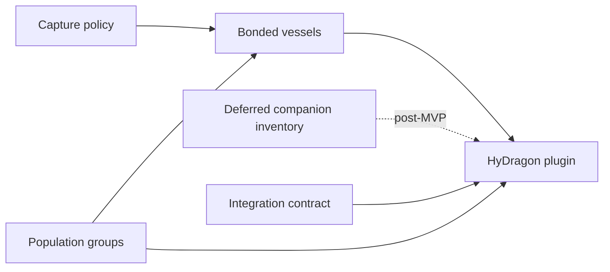

# HyDragon enablement specifications

Status: Proposed
Target: Tamework 3.x (backward-compatible additions)
Consumer: HyDragon plugin, requiring Tamework `>=3.0.0 <4.0.0`

The current suite adds an experimental Public API `0.9.0` surface for capture
policy, bonded vessels, population groups, and companion provisioning; mod and
API versions remain independent, so consumers must still use capability checks.
The companion-inventory design is retained for a later update and is not part
of API `0.9.0` or the current schema migration.

This suite specifies the generic Tamework capabilities required to finish the
HyDragon gameplay loop. The capabilities are deliberately content-neutral:
Tamework owns companion identity, lifecycle, admission, item/profile
transactions, and persistence safety; HyDragon owns dragons, materials,
balance, elemental powers, rituals, encounters, and presentation.

## Fixed integration decisions

- Miniwyverns are Soul Bond-exclusive. Ordinary capture items must not capture
  them.
- Dragon flight uses the bundled item ID
  `Tamework_Flightmasters_Talisman`; no third-party flight-mod bridge is part of
  the baseline.
- MVP stone maintenance is one Tamework-owned 10,000 ms summon/store transition
  cooldown plus death repair using HyDragon's Revitalizing Essence transaction.
  Energy, summon-duration, and charge depletion remain deferred extensions.
- HyDragon targets Tamework `>=3.0.0 <4.0.0` and checks capabilities at runtime.
- Existing `TwSpawnerConfig` assets remain deterministic, disposable capture
  containers unless they explicitly opt into the new behavior. Capture chance
  uses `ChanceMode: Guaranteed` by default and requires an explicit
  `ChanceMode: Probability` opt-in.
- A copied or stale bonded vessel always fails closed. Binding generations are
  durable and increment on each accepted transition.
- A group active limit counts `ACTIVE`, durably `UNLOADED`, and pending or
  committed `RESTORING` admissions.
- An opted-in probabilistic capture obtains at most one random roll, at commit
  after all mutable eligibility conditions are revalidated; it obtains exactly
  one only when neither guaranteed mode nor `GuaranteedAtPower` resolves the
  outcome. Failure leaves NPC and ownership unchanged, retains the empty item,
  and may apply a configured failure cooldown.
- The Miniwyvern backpack and generic companion inventory are deferred
  post-MVP. When implemented, inventories are canonical-profile-scoped and may
  never silently destroy items during capacity reduction or profile deletion.

## Documents

| Specification | Tamework responsibility | HyDragon counterpart |
| --- | --- | --- |
| [Capture policy](capture-policy.md) | Capture power, role resistance, exactly-once chance, failure feedback | [Capture, summoning, and maintenance](https://github.com/Alechilles/HyDragon/blob/main/docs/specs/capture-summoning-maintenance.md) |
| [Bonded vessels](bonded-vessels.md) | Durable item-to-profile binding, generation fencing, summon/store lifecycle | [Capture, summoning, and maintenance](https://github.com/Alechilles/HyDragon/blob/main/docs/specs/capture-summoning-maintenance.md) |
| [Population groups](population-groups.md) | Per-owner group membership and atomic owned/active limits | [Soul Bond and Miniwyvern](https://github.com/Alechilles/HyDragon/blob/main/docs/specs/soul-bond-miniwyvern.md) and [dragon content and encounters](https://github.com/Alechilles/HyDragon/blob/main/docs/specs/dragon-content-encounters.md) |
| Deferred: [Companion inventory](companion-inventory.md) | Post-MVP profile-scoped storage, UI/session safety, overflow and recovery | [Soul Bond and Miniwyvern](https://github.com/Alechilles/HyDragon/blob/main/docs/specs/soul-bond-miniwyvern.md) |
| [Integration contract](integration-contract.md) | Version/capability contract, ownership boundaries, event ordering | [Plugin architecture](https://github.com/Alechilles/HyDragon/blob/main/docs/specs/plugin-architecture.md) |

HyDragon's suite begins at its
[specification index](https://github.com/Alechilles/HyDragon/blob/main/docs/specs/README.md).

## Responsibility boundary

### Tamework adds

- Generic, asset-driven capture probability inside the authoritative capture
  transaction.
- A bonded mode for spawner items that represents one canonical companion
  profile while stored, active, dead, lost, or transitioning.
- Group-scoped owner and active limits integrated into the existing population
  admission journal.
- A generic, idempotent companion-provisioning API that creates one owned
  canonical profile through normal group admission before optional projection.
- Public capability flags, immutable views, lifecycle events, diagnostics, and
  self-test coverage for the current systems.

### Tamework adds later

- Optional profile-scoped companion inventory with durable overflow and
  recovery claims, after the current HyDragon MVP integration is complete.

### HyDragon adds

- Draconic Stone item tiers and capture values.
- Draconic Altar, recipes, drops, Revitalizing Essence, and all presentation.
- Soul Bond entitlement and the Miniwyvern creation ritual.
- Elemental archetype selection and active/passive abilities.
- Dragon-specific stone condition, death-repair economy, swap presentation, and
  encounter controllers. Energy, duration, and charge depletion are deferred
  optional HyDragon extensions.
- Config assets that assign full dragons and Miniwyverns to the appropriate
  population groups.

### Explicit non-goals for Tamework

- No hardcoded HyDragon role, ore, essence, altar, or item IDs.
- No generic implementation of elemental combat or Soul Bond lore.
- No replacement for `TwCommandItemConfig`, avatar flight, progression,
  interaction extensions, or existing global owner/claim limits.
- No best-effort state mutation when persistence or population authority is not
  ready. Positive admissions and destructive transitions fail closed.

## Dependency graph

Capture policy can ship independently. Bonded-vessel spawning must use group
admission before it can be considered production-ready. Deferred companion
inventory remains independent of vessels because its identity is the canonical
profile rather than an item stack or live entity UUID.

## Shared invariants

1. `profile_id` is the canonical companion identity. Live NPC UUIDs and item
   locations are replaceable projections.
2. Every positive population mutation uses prepare/claim/apply/commit or
   prepare/cancel; preflight-only checks never authorize a mutation.
3. Durable state enters an applying/transitioning state before a world or
   inventory side effect.
4. Retries reuse a stable operation or attempt ID. A callback retry is not a
   new gameplay attempt.
5. World/ECS mutations run on the owning world thread. SQLite and other durable
   I/O never block that thread.
6. Unknown, ambiguous, stale-generation, degraded, or unavailable authority
   denies positive/destructive work and records actionable diagnostics.
7. Config reloads affect the next operation. An in-flight operation remains
   bound to the resolved config revision recorded when it was prepared.
8. Existing over-limit or legacy companions are preserved; new positive
   admissions remain blocked until the applicable count is within policy.
9. Item metadata is evidence, not authority. Durable binding, lifecycle,
   profile, and population records decide whether a projection is current.
10. Public event payloads are immutable snapshots and are emitted only after
    their corresponding durable state is committed.

## Configuration and inheritance baseline

Every new `Tw*Config` family and every new top-level section follows the
Tamework asset inheritance contract:

- An omitted top-level key inherits the parent value.
- An explicitly authored object keeps explicit nested fields and inherits its
  missing nested fields.
- An explicit scalar replaces the parent scalar.
- An explicit array or map replaces the parent value; arrays/maps never append
  or union implicitly.
- A top-level value that is explicit but not a JSON object is not nested-merged.
- Codec tooltips must state these rules, and tests must cover omitted sections,
  partial object sections, and explicit array/map replacement.

`TwSpawnerConfig` remains item-scoped and participates in `/tw reloadconfig`.
New role/group-scoped families update through ordinary asset loaded/removed
events, matching existing Tamework behavior. Invalid assets are excluded from
resolution with an asset-ID-specific warning; the last valid compiled index
remains authoritative during an unsuccessful hot reload.

## Implementation landing requirements

The implementation should land as coordinated, reviewable slices, but the
following surfaces must agree before release:

- one backup-first, transactional, idempotent schema v8 plan for attempt,
  binding, group-classification, provisioning, and operation data; inventory
  tables use a separately versioned future migration;
- asset-store registration, internal/public config-family enums, override
  paths, schema editor adapters, codec documentation, example/default assets,
  loaded/removed hooks, and config-read views for each current family;
- Public API `0.9.0`, fail-closed default methods, capability advertisement,
  immutable events/views, unit compatibility tests, and `/tw api test` fixtures;
- persistence domains, mutation-availability gates, incident reasons, circuits,
  recovery, integrity diagnostics, and privacy-safe aggregate telemetry;
- canonical `/wiki` config/API/index/recipe updates, contributor docs,
  `CHANGELOG.md`, and regenerated agent documentation. The stale public API
  dependency example must be updated to the Tamework 3.x contract.

No implementation slice may temporarily use `ProfileDataApi` or item metadata
as canonical storage for a Tamework-owned state while waiting for its schema
work.

## Delivery order

1. Implement [capture policy](capture-policy.md) and its durable attempt journal.
2. Implement [population groups](population-groups.md), including reconciliation,
   group-aware public population admission, and companion provisioning.
3. Implement [bonded vessels](bonded-vessels.md) on those admission primitives.
4. Publish the [integration contract](integration-contract.md) and live API
   fixture coverage.

Post-MVP: implement [companion inventory](companion-inventory.md) as a separate
versioned update. HyDragon ships its initial Miniwyvern without a backpack.

## Definition of suite completion

The current HyDragon enablement suite is complete when capture policy,
population groups/provisioning, bonded vessels, and the integration contract
satisfy their acceptance tests; their public capabilities appear in
`/tw api test`; schema and codec docs are generated; `/tw diagnose` reports
their health; and a packaged HyDragon integration test demonstrates this loop:

1. A tier-qualified stone begins capture.
2. Completion revalidates and records exactly one outcome, obtaining at most
   one entropy sample and none for guaranteed outcomes.
3. Success binds one canonical profile to one current vessel generation.
4. Summoning reserves the applicable full-dragon active group slot.
5. A second full dragon is denied while the first is active or durably unloaded.
6. Storing the first dragon releases the active slot and preserves its profile.
7. A copied stale vessel cannot spawn, store, repair, or supersede the binding.
8. A Soul Bond provisions at most one Miniwyvern profile for the owner; failed
   initial projection leaves that one profile dormant/recoverable.

The deferred companion-inventory specification has its own later completion
gate and does not block this suite or the initial HyDragon release.
