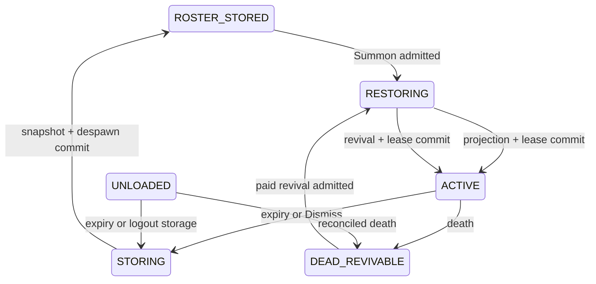

# Command-Roster Capture, Timed Summoning, and Paid Revival Specification

Status: Proposed replacement for the unreleased bonded-vessel subsystem
Target: Tamework 3.x
Consumer: HyDragon `>=3.0.0 <4.0.0`

HyDragon counterpart: [Draconic capture, Dragon Horn, and revival](https://github.com/Alechilles/HyDragon/blob/main/docs/specs/capture-summoning-maintenance.md)

## 1. Goal

Extend Tamework's existing capture, canonical profile, command-item, population, and revival systems so a consumable capture item can tame an NPC in place and atomically add it to an owner-scoped command roster. Add population-backed active limits, per-profile timed summon leases that return companions to roster storage, and generic multi-component inventory costs for command-panel revival. These are asset-driven capabilities; Tamework must not hardcode dragons, stones, horns, eggs, ore names, or essence IDs.

This design replaces one-companion-per-vessel storage. Physical command items remain player access tools, while canonical command membership is durable per owner and command family.

## 2. Locked decisions

- Existing capture-item behavior remains the default for configs that do not opt in.
- Opted-in `ResolvedAttempt` consumption spends one source item for every durably resolved success or failure.
- No item is spent for preflight denial, cancellation, stale completion, or another condition that prevents the roll.
- `TameAndCommandLink` success tames and role-maps the existing NPC in place, creates/preserves one profile, and adds it to a configured command family.
- Command-family membership is durable Tamework authority. Item metadata is a cache and UI projection only.
- Active limits remain `TwPopulationGroupConfig` authority and may be any non-negative configured value; command items do not maintain a second count.
- An opted-in role may have a finite summon lease. Expiry or manual dismissal durably snapshots/despawns the projection into `ROSTER_STORED`, releases active capacity, and starts a configured cooldown.
- A paid revive consumes every component of its configured item-agnostic cost exactly once and restores the same profile exactly once.
- Capture, roster link, provisioning, population admission, timed summoning, and revival are capability-gated through the public API.
- The bonded-vessel subsystem and capability are removed. Tamework needs no HyDragon migration behavior because HyDragon has never shipped.

## 3. New and changed configuration

### 3.1 `TwSpawnerConfig.Capture`

Add inherited fields:

| Field | Type/default | Meaning |
| --- | --- | --- |
| `SourceConsumption` | enum `SuccessOnly` | `SuccessOnly` preserves current behavior; `ResolvedAttempt` consumes one source item after either a successful or failed terminal roll |
| `SuccessDisposition` | enum `CapturedItem` | `CapturedItem` uses the existing filled-item finalizer; `TameAndCommandLink` keeps the target live and links its canonical profile |
| `CommandFamilyId` | string/null | Required for `TameAndCommandLink`; names the durable roster family |
| `RequiredCommandConfigId` | string/null | Optional exact command config that must resolve for an access item in the actor's supported inventory compartments |
| `RequireCommandAccessItem` | boolean `false` | When true, missing access item denies before roll and consumption |

Example consumer configuration:

```json
{
  "Capture": {
    "ChanceMode": "Probability",
    "SourceConsumption": "ResolvedAttempt",
    "SuccessDisposition": "TameAndCommandLink",
    "CommandFamilyId": "hydragon:dragon_horn",
    "RequiredCommandConfigId": "HyDragonDragonHorn",
    "RequireCommandAccessItem": true
  }
}
```

Validation rules:

- `TameAndCommandLink` requires `TamesTarget: true`, `CommandFamilyId`, an owner-establishing capture path, and a valid tamed-role result.
- `RequireCommandAccessItem: true` requires a resolvable `RequiredCommandConfigId` whose role policy allows the post-capture role.
- `ResolvedAttempt` is valid only for a capture mode with a durable attempt journal and exact source-stack fencing.
- `TameAndCommandLink` does not use `FilledItemId`. An inherited value is ignored; an explicitly authored non-blank value is rejected as contradictory configuration.
- Explicit values and nested inheritance follow the normal Tamework config contract. Invalid combinations are excluded from the compiled registry.

### 3.2 `TwCommandItemConfig`

Add inherited fields:

| Field | Type/default | Meaning |
| --- | --- | --- |
| `CommandFamilyId` | string/null | Stable namespace for command membership shared by all access items in that family |
| `RosterStorage` | enum `ItemMetadata` | `ItemMetadata` preserves existing behavior; `OwnerCommandFamily` uses the durable owner/family roster |
| `ProjectRosterToItemMetadata` | boolean `true` | Allows UI/cache projection without making metadata authoritative |

`OwnerCommandFamily` requires `CommandFamilyId`, `RequireOwner: true`, and profile-capable recipients. All item IDs resolved by that command config are equivalent access keys for the acting owner's family roster.

### 3.3 `TwCompanionConfig.Command.Revive`

Replace the flat HyDragon use of cooldown-only revival with an inherited nested block:

| Field | Type/default | Meaning |
| --- | --- | --- |
| `Enabled` | boolean/current resolved behavior | Enables command-panel revival for the role |
| `GameplayCooldownMs` | integer/current cooldown | Balance cooldown after death; may be zero |
| `Costs` | ordered `TwItemCostComponent[]`, empty | All item components required and consumed on successful revival |
| `InsufficientCostMessage` | string/null | Optional localization key override |

`TwItemCostComponent` is a reusable content-neutral codec/value object with exact `ItemId` and positive integer `Quantity`. The ordered array is an AND cost: every component is required. Different roles may use different IDs and quantities, including several different item types in one payment. Duplicate item IDs are rejected so UI, reservation, and refund totals remain unambiguous. An explicit array replaces the inherited array. Empty costs preserve free revival for other Tamework users; HyDragon must configure a non-empty cost for every relevant role. The generic type must be reusable by later features such as animal-husbandry revival priced in Life Essence.

The linked-panel quote renders every component in configured order with item icon, localized item name, `owned / required` quantity, and explicit shortage styling. Confirmation is disabled if any component is missing. A compact summary may be used on the row, but the confirmation view must never hide part of a multi-item cost.

Existing `DeadRespawnCooldownMs`/`DeadRespawnCooldownMins` remain readable during Tamework's own config transition, but the implementation and generated docs should converge on the `Revive` block. This is Tamework schema evolution, not a HyDragon migration requirement.

### 3.4 `TwCompanionConfig.Command.Summon`

Add an inherited nested block:

| Field | Type/default | Meaning |
| --- | --- | --- |
| `Enabled` | boolean `false` | Enables Horn/panel Summon, Dismiss, and roster-stored lifecycle for the role |
| `ActiveDurationMs` | integer `0` | Maximum active time in one admitted session; `0` means unlimited |
| `ResummonCooldownMs` | integer `0` | Cooldown after expiry or manual dismissal before a new Summon |
| `AutoStoreOnOwnerLogout` | boolean `true` | Safely stores an active companion when its owner disconnects |
| `ExpiryWarningThresholdsMs` | integer array `[]` | Descending unique remaining-time thresholds for player warnings |

Durations and thresholds must be non-negative. Positive thresholds must be less than `ActiveDurationMs`, strictly descending, and unique. An explicit threshold array replaces the inherited array. `Enabled: false` preserves existing command behavior. `ActiveDurationMs: 0` allows roster storage/summoning without automatic expiry.

Population concurrency is not configured here. Every projection transition still reserves all matching `TwPopulationGroupConfig.Limits.MaxActivePerOwner` constraints.

## 4. Durable command-family roster

### 4.1 Identity

Canonical membership key:

```text
(owner_uuid, command_family_id, profile_id)
```

Required row data:

```text
owner_uuid
command_family_id
profile_id
membership_revision
active_for_bulk_commands
group_id nullable
home_world nullable
home_position nullable
cached_display_name nullable
cached_name_key nullable
cached_role_id nullable
cached_command_state nullable
created_at
updated_at
last_operation_id
summon_session_id nullable
summon_state: ROSTER_STORED | RESTORING | ACTIVE | STORING | DEAD | LOST
summon_remaining_ms nullable
resummon_cooldown_until_ms nullable
summon_config_id nullable
summon_config_revision nullable
summon_last_checkpoint_at nullable
```

Live entity UUID, last-known position, status, health, and other projection details are resolved from the canonical profile/lifecycle stores and may be cached. They are not membership identity.

### 4.2 Access-item behavior

- Opening or using any registered `OwnerCommandFamily` item resolves the acting player plus its `CommandFamilyId`.
- All legitimate copies show the same roster and preferences for that owner/family.
- Dropping or transferring an item transfers only the physical access item. It never transfers roster membership or profile ownership.
- Destroying every access item does not delete the roster. Acquiring a replacement restores access.
- Item metadata may cache a signed/revisioned projection for responsive UI, but stale, copied, edited, or missing metadata cannot create or erase membership.
- Existing `ItemMetadata` command configs retain current behavior.

### 4.3 Membership mutation

Roster add, remove, group, active-toggle, and home mutations use optimistic revision fencing and namespaced idempotency keys. Adding the same profile twice is an idempotent success. Removing a row does not release ownership, delete the profile, or cull the NPC unless a separate explicit operation is authorized.

Automatic tame linking and public provisioning may target an owner-command-family roster. The mutation must validate the command config's owner, tame, allowed-role, and max-target policy against the resulting profile.

## 5. Capture transaction

### 5.1 Pre-roll validation

For `TameAndCommandLink` with `ResolvedAttempt`:

1. Resolve the exact source stack, actor, target, spawner config revision, target policy revision, and command config revision.
2. Validate channel, target identity/liveness/role, health, effect, range, owner policy, minimum power, special requirements, and retry cooldown.
3. Validate owner/profile/population mutation readiness.
4. When required, locate and fence one compatible command access item; validate its command family and post-capture role policy.
5. Prepare canonical profile, ownership, population, tamed-role, and roster membership mutations under one operation ID.
6. Persist the unrolled attempt. Any failure through this step cancels without entropy or item consumption.

### 5.2 Resolution and source spend

1. Revalidate all mutable fences on the owning world thread.
2. Atomically resolve the attempt exactly once as success or failure.
3. For `ResolvedAttempt`, transition the attempt to a durable source-consumption state and exact-CAS decrement the configured source quantity by one.
4. If source consumption cannot be proven, do not publish the result or mutate the target. Retry recovery under the same attempt ID.
5. Once consumption commits, a failed result commits its cooldown and feedback; a successful result proceeds to apply.

The source spend and roll form one recoverable logical boundary. A player cannot receive a resolved attempt for free, and a retried callback cannot spend twice.

### 5.3 Failed result

Failure cancels prepared owner/profile/population/roster mutations, leaves the target live and unchanged, commits the configured cooldown, and emits one `FAILED_ROLL` event that reports source consumption. Cosmetic failure cannot change the result.

### 5.4 Successful result

Success:

1. Claims prepared owner/profile/population/roster admission.
2. Applies ownership, tame state, and configured tamed-role mapping to the existing live NPC on the owning world thread.
3. Commits the canonical profile without transitioning it to captured-item storage.
4. Commits one command-family membership row.
5. Commits the attempt and emits one post-commit capture/link result.

The existing NPC remains in the world. There is no filled-item replacement or spawn-item metadata. If apply is interrupted after the recorded success, recovery resumes the same operation and never re-rolls or consumes again.

If recovery proves that a successful apply is terminally impossible because of an internal/runtime fault after source consumption, it cancels every prepared positive mutation and creates one durable replacement-source recovery claim. This compensation is not used for an ordinary failed roll or player-caused invalidation. The operation can resolve to a committed capture or one replacement claim, never both.

## 6. Provision-and-link transaction

Extend companion provisioning so a caller may request an optional command-family membership in the same idempotent operation:

```text
provision(owner, role, populationGroup, initialLifecycle,
          commandFamilyId?, requiredCommandConfigId?, idempotencyKey)
```

This supports HyDragon's Wyvern Egg without a dedicated summon item. A retry returns the same profile and membership. Initial projection is a separate admitted step; projection failure leaves the profile dormant and visible in the roster.

Public request and result objects are immutable. Existing provisioning callers remain source- and behavior-compatible through overloads/default methods or a new versioned request type.

## 7. Command, placement, active limits, and timed summoning

Owner-command-family rows participate in the existing linked panel, command radial, group management, Summon, Dismiss, Locate, Recall, home, death, lost recovery, and status lanes.

- UI rows are sourced from the roster joined with canonical profile/lifecycle state, not from the held item's cached list.
- Loaded and unloaded resolution remains profile-first.
- Recall and recovery preserve normal population admission and cross-world safety.
- Default safe-placement ordering for Recall and command revival searches in front of the player first, then side offsets, then wider fallback candidates. Behind-player candidates are last-resort only and must never be the first valid default.
- Placement failure leaves the profile and roster unchanged and returns a stable reason.

### 7.1 Active-cap enforcement

`TwPopulationGroupConfig.Limits.MaxActivePerOwner` is the sole balance authority for how many matching profiles one owner may project concurrently. Zero remains unlimited; any positive value is enforced without hardcoded HyDragon assumptions.

Active headroom includes committed `ACTIVE`, durable `UNLOADED`, committed `RESTORING`, `STORING`, pending positive admissions, and ambiguous states that may still contain a live projection. Capacity is released only after durable transition to `ROSTER_STORED`, `DEAD_REVIVABLE`, or permanent release. Capture tame/link, Summon, provisioned projection, revival, lost recovery, and cross-world recovery reserve the same group constraints.

Cap denial leaves the profile, roster, source item, timer, cooldown, and world unchanged. For capture it occurs before entropy and stone consumption.

The linked panel shows authoritative `active / limit` population status for the selected row's matching groups and uses an explicit unlimited label for zero. A projected-result action is disabled when any applicable group lacks headroom, with the blocking group and stable localized reason available in the confirmation/details view.

### 7.2 Roster-stored lifecycle

`ROSTER_STORED` is a canonical dormant lifecycle for an owned command-family profile with no live projection and no captured item. It counts as owned but not active. It is distinct from captured-item `CAPTURED` and initial `PROVISIONED_DORMANT`.

Allowed transitions:



`Summon` is available only for `ROSTER_STORED` after cooldown. `Recall` relocates an already active/unloaded profile and never starts or resets a lease. `Dismiss` is available for active/unloaded profiles and invokes the same storage transaction as expiry.

### 7.3 Lease start and accounting

- Successful `TameAndCommandLink` capture starts the first lease on the existing live projection.
- Successful Horn Summon and paid revival start a new lease with the role's snapshotted `ActiveDurationMs`.
- Each profile owns an independent `summon_session_id`; no owner-wide timer pool is implied.
- A lease decrements while the companion is canonically active or durably unloaded during the running server session.
- Recall, relocation, command changes, mount state, chunk unload, UI close/reopen, and item replacement preserve remaining time.
- Owner logout with `AutoStoreOnOwnerLogout: true` initiates safe storage. A completed later Summon receives a new full lease only after cooldown.
- Shutdown checkpoints remaining time and operation state. Server downtime does not decrement it, and startup recovery cannot replenish it.
- Warnings are emitted at most once per configured threshold/session. The linked panel always shows authoritative remaining time.

### 7.4 Expiry and manual storage transaction

1. Fence profile revision, projection identity, session ID, remaining time, lifecycle, population evidence, and config revision.
2. Persist `STORING` under a stable operation ID before destructive world mutation.
3. Capture the canonical live/deferred snapshot needed to restore the exact profile later.
4. Safely dismount riders and terminate incompatible interactions according to normal command-storage policy.
5. Remove the live projection exactly once on the owning world thread.
6. Commit `ROSTER_STORED`, zero active delta, and `resummon_cooldown_until_ms`.
7. Update the roster row and notify the owner with stored/cooldown status.

Until step 6 commits, active capacity remains occupied. Duplicate expiry ticks, Dismiss clicks, logout callbacks, or restart recovery reuse the same session/operation and cannot remove twice. If snapshot/removal is temporarily unavailable, `STORING` retries and blocks new projection. Recovery converges to exactly one active projection with the original remaining time or one roster-stored profile with cooldown.

## 8. Paid revival transaction

### 8.1 Quote and confirmation

For a dead roster row, the linked panel resolves the role's current `Revive` configuration and displays every required item icon, localized name, required quantity, owned quantity, and shortage before confirmation. All components are conjunctive. The server re-resolves the config revision and inventory at commit; client UI is never authority.

### 8.2 Commit sequence

1. Resolve actor, owner, command family, profile, death record, role config revision, population group, and target world.
2. Validate revival enablement, ownership, roster membership, dead/revivable state, cooldown, persistence health, population admission, and safe placement.
3. Locate and exact-fence every required inventory component. Split each item total across stacks deterministically without exceeding the quoted quantities.
4. Persist a revival operation and inventory reservation under one idempotency key.
5. Prepare the existing profile/death/population recovery transition.
6. Consume all reserved costs exactly once.
7. Commit revival of the same profile, one safe projection, and one new summon lease when the role enables timed summoning.
8. Commit lifecycle/roster status, release reservations, and emit one result event.

If failure occurs before durable cost consumption, release reservations and charge nothing. After an ambiguous crash, recovery queries the same operation. Terminal inability to finish after a proven charge creates one durable owner refund/recovery claim. It never silently drops the cost.

### 8.3 Invariants

- One dead profile can have at most one live revival operation.
- Duplicate confirmation returns the existing operation result.
- A config reload cannot change the cost of an in-flight operation.
- Inventory movement invalidates stale fences before consumption.
- Missing any one cost component prevents reservation and consumes nothing from every component.
- Refund/recovery reproduces the exact consumed component list and quantities rather than one aggregate currency value.
- Successful revival preserves profile ID, name, progression, traits, attachments, and command-family membership.
- Insufficient cost, capacity denial, unsafe placement, or unavailable persistence causes no charge and no projection.

## 9. Public API and capabilities

Replace `BONDED_VESSELS` with granular capabilities:

- `COMMAND_FAMILY_ROSTERS`
- `CAPTURE_TAME_AND_LINK`
- `CAPTURE_RESOLVED_ATTEMPT_CONSUMPTION`
- `COMMAND_TIMED_SUMMONING`
- `PAID_COMMAND_REVIVAL`

Required public surfaces:

- immutable command-family roster query and idempotent membership mutation;
- capture config views for source consumption and success disposition;
- provision-and-link request/result;
- Summon/Dismiss/lease query, operation result, and lifecycle events;
- revive quote, prepare/commit/query result, and recovery status;
- post-commit roster membership, capture, and paid-revival events;
- stable denial/recovery reason codes;
- aggregate, non-player-scoped diagnostics usable from server console.

HyDragon must gate each dependent feature independently. Missing paid revival may disable Revive without disabling ordinary Horn commands; missing timed summoning must disable HyDragon Summon and tame/link before a time-limited profile can be made active; missing tame-and-link must disable Draconic Stone attempts before a roll.

## 10. Persistence and recovery

Add durable storage for command-family membership, roster-stored lifecycle, summon sessions/remaining time/cooldowns/storage operations, source-consumption state where the capture journal does not already cover it, paid revival operations, inventory reservations, and exact multi-component capture/revival refund claims. Schema changes follow Tamework's backup-first transactional migration policy.

Recovery order:

1. hydrate canonical profiles and population authority;
2. reconcile command-family roster references;
3. resume capture attempts that have a resolved outcome or pending source spend;
4. resume provisioning/link operations;
5. resume timed storage/summon sessions and reconcile active population slots;
6. resume paid revival and refund claims;
7. expose command UI/actions only after required authorities report ready.

Unknown or contradictory positive state quarantines the operation and fails closed. Diagnostics identify the operation/profile/family and bounded reason without exposing unrelated player data.

## 11. Bonded-vessel removal

Remove:

- `BONDED_VESSELS` capability and `TameworkApi.bondedVessels()`;
- public bonded-vessel views, requests, results, events, and reason codes;
- `TwSpawnerConfig.Vessel` codec/runtime fields;
- binding/generation/state tables, repositories, coordinators, recovery, diagnostics, and self-tests;
- summon/store/repair dispatch based on vessel item state;
- vessel-specific population evidence and inventory cross-links;
- example/default vessel assets and schema documentation.

Before deletion, use repository search and compile failures to enumerate consumers. Convert HyDragon to the new capabilities in the same coordinated development window. No HyDragon compatibility shim, schema import, item reader, alias, or adoption operation is required. Tamework's own development database may receive a migration that drops obsolete tables only if its normal schema policy requires the version transition; this is not a player-facing HyDragon migration.

## 12. Diagnostics and operator commands

All read-only diagnostics must work from console without player identity. Player identity is an optional filter, not a command prerequisite.

At minimum:

- `/tw diagnose command-family [owner] [family]`
- `/tw diagnose capture-attempt <attempt-id>`
- `/tw diagnose provision <operation-id>`
- `/tw diagnose revive <operation-id-or-profile>`
- `/tw api test`

Output reports capability readiness, counts, operation states, queue/recovery health, and bounded incident IDs. Commands that mutate inventories, ownership, or world state remain permission-gated and require explicit targets.

## 13. Implementation map

| Area | Existing anchor | Required work |
| --- | --- | --- |
| Capture config | `TwSpawnerConfig`, `ItemFeatureConfig` | Add/validate/inherit source-consumption and success-disposition fields |
| Capture journal | capture policy persistence/services | Add recoverable one-item spend and tame/link apply states |
| Finalization | `SpawnerCaptureFinalizerService` | Branch captured-item versus in-place tame/link without mixing paths |
| Command config | `TwCommandItemConfig` | Add family ID and roster storage mode |
| Command persistence | `CommandLinkedNpcRecordStore` and SQLite persistence | Add owner/family/profile authority; make item metadata a projection for opted-in configs |
| Command UI/runtime | `CommandItemFeatureHandler` and linked-panel services | Source opted-in rows from canonical roster; render state, timer, cooldown, and complete cost quotes |
| Provisioning | public/internal provisioning API | Optional atomic family membership |
| Timed summoning | command relocation/placement, profile lifecycle, population authority | Summon/Dismiss, per-profile lease, `ROSTER_STORED`, warning, cooldown, storage recovery |
| Revival | `CommandLinkedNpcDeathService`, `CommandRespawnService` | Generic multi-component cost quote, reservation, exact consumption, recovery/refund, lease start |
| Placement | `CommandCompanionPlacementService` | Prefer safe in-front candidates for Recall and Revive |
| Public API | capability/config/event surfaces | Add granular capabilities and remove bonded vessels |
| Persistence | schema/repositories/recovery | Roster, lease/storage, spend, revive, exact refund, and obsolete-vessel removal |
| Diagnostics | command/API self-tests | Non-player-scoped health and operation inspection |

## 14. Acceptance criteria

### Compatibility

1. Existing configs with omitted new fields preserve current captured-item and success-only consumption behavior.
2. Existing `ItemMetadata` command configs preserve their current link behavior.
3. Invalid field combinations fail asset validation with the asset ID and actionable reason.
4. Parent/child tests cover omitted nested sections, partial overrides, and array replacement.

### Capture

5. Preflight denial and cancellation use zero entropy and consume zero items.
6. A resolved failed roll consumes one configured source item, mutates no NPC/profile/owner state, and commits one cooldown.
7. A resolved success consumes one item, tames the same NPC/profile in place, and creates one roster row.
8. Duplicate and concurrent completions obtain one result and one source spend.
9. Restart at every resolution/spend/apply checkpoint converges without a free roll, double spend, duplicate profile, or duplicate row; terminal internal apply failure produces one replacement-source claim and no capture.
10. Missing required command access denies before roll and spend.

### Roster and commands

11. All legitimate family access-item copies show the same owner roster.
12. Losing all access items preserves the roster; a replacement restores access.
13. Transferring/copying an item does not transfer or duplicate roster authority.
14. Existing panel, command, group, Summon, Dismiss, Locate, Recall, home, dead, lost, and cross-world behavior works with roster-backed rows.
15. Recall prefers a safe position in front of the player.

### Active limits and timed summoning

16. Any positive `MaxActivePerOwner` is enforced atomically across capture, Summon, provisioning, revival, and recovery; zero remains unlimited.
17. `ROSTER_STORED` counts owned but not active; `ACTIVE`, `UNLOADED`, `RESTORING`, `STORING`, and ambiguous potentially-live state retain active capacity.
18. Capture success, Summon, and paid revival start exactly one snapshotted per-profile lease.
19. Recall, movement, mount, command, unload, relog, item replacement, and UI actions never reset or duplicate a lease.
20. Expiry and Dismiss snapshot/despawn once, commit `ROSTER_STORED`, release one slot, start one cooldown, and show the new state/time in the UI.
21. Restart at every lease/storage checkpoint preserves remaining time and converges to one active or one stored projection state.
22. Owner logout auto-storage and server downtime follow the configured/accounting contract without granting extra active time.

### Provisioning and revival

23. Provision-and-link retries return one profile and one membership.
24. Projection failure leaves a dormant/recoverable roster row and starts no lease.
25. Paid revival clearly quotes every configured item component with icon/name and owned/required quantities, consumes all components exactly once, revives the same profile once, and starts one lease when enabled.
26. Cost codecs accept arbitrary item IDs and positive quantities, support several different item components, reject duplicate IDs, and remain reusable outside command revival.
27. Missing any component, cooldown, capacity, placement, permission, or persistence denial charges nothing from every component.
28. Restart at each paid-revival checkpoint converges to no charge/no revive, one exact multi-item charge/one revive, or one exact multi-item refund claim.

### Removal and operations

29. Tamework compiles and passes tests with no bonded-vessel capability, API, config, persistence, runtime, diagnostics, docs, or examples.
30. No HyDragon-specific migration or compatibility code is introduced.
31. Required diagnostics run from server console and accept an optional player filter.
32. Packaged HyDragon integration proves failed-stone spending, live tame/link, active cap, timed expiry/storage/resummon, Egg provision/link, Horn replacement, exact multi-item paid revival, and restart recovery.

## 15. Delivery order

1. Add command-family roster schema, config, runtime, UI sourcing, API, and tests.
2. Add capture source-consumption policy and tame/link finalizer.
3. Add provision-and-link.
4. Add configurable active limits, `ROSTER_STORED`, timed Summon/Dismiss, UI status, and recovery.
5. Add reusable multi-component item costs, paid revival, and in-front placement.
6. Convert HyDragon assets/runtime and packaged integration tests.
7. Remove bonded-vessel code, schema/API/config/docs, then run repository-wide reference checks.
8. Run clean unit/integration/package suites and live-server acceptance.
