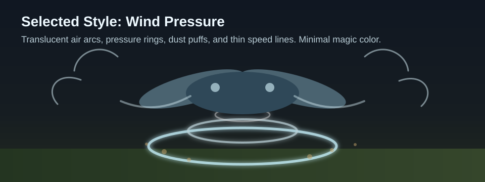
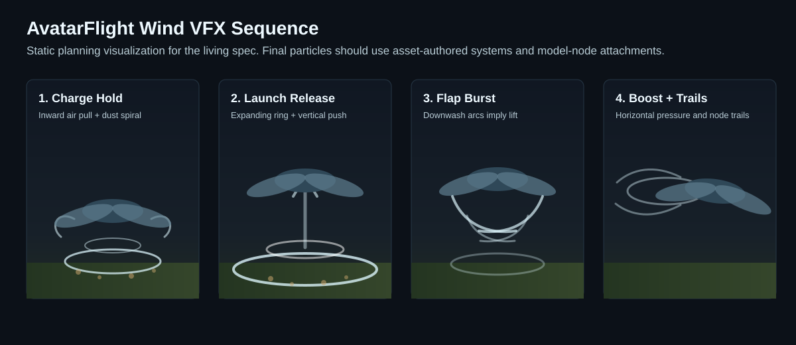

# Avatar Flight Wind VFX Design

## Purpose

Avatar flight movement already has distinct launch, flap, boost, glide, and fast-flight states. The VFX layer should make those state changes readable and satisfying without turning the transformed dragon into a magical aura effect.

The selected visual direction is wind pressure: translucent air arcs, ground rings, dust puffs, compression ripples, and thin speed lines. Effects should communicate force direction first and power level second.

## Current Context

Relevant existing behavior:

- Holding jump on the ground charges a launch. Releasing after the minimum charge applies upward and forward launch impulse.
- Left-click with Flightmaster's Reins queues an upward flap.
- Q with Flightmaster's Reins queues a forward boost.
- The movement controller already exposes one-tick output flags for `launchApplied`, `jumpApplied`, and `boostApplied`.
- Fast flight is already derived from boost-active forward flight and is visible to animation/HUD code.

This suggests a presentation layer can react to existing movement results instead of changing flight physics.

## Goals

- Add readable wind-style VFX for launch charge, launch release, flap, boost, and high-speed flight.
- Keep VFX configurable through AvatarFlight config/assets rather than hardcoding particle IDs in controller logic.
- Prefer base-game particle/model attachment systems where possible.
- Keep burst effects one-shot and trails explicitly start/stop so persistent effects cannot orphan.
- Avoid noisy per-tick particle spawning unless throttled or represented as a persistent attached effect.

## Non-Goals

- Do not rebalance AvatarFlight movement in this VFX pass.
- Do not add magical Vigour aura effects as the primary visual language.
- Do not make VFX required for movement correctness.
- Do not add broad particle infrastructure unrelated to AvatarFlight.

## Visual Direction

Selected direction: `Wind Pressure`.

The effect language should feel physical:

- launch charge: air pulls inward and dust begins circling under the dragon;
- launch release: a compressed ground ring expands outward as the dragon is pushed up;
- flap: a quick downward/upward air burst from wings and body, implying lift;
- boost: horizontal pressure streaks and a short shock-cone push behind the dragon;
- high-speed trails: thin translucent wind ribbons from model nodes while speed remains high.

Color should stay mostly white, pale blue, and low-opacity grey. Dust can use warm ground tones when emitted near terrain. Avoid green/gold Vigour motes for the first version.

## Effect Sequence Preview

The sequence preview is planning art, not a literal particle implementation. It captures the intended read:

- charge hold builds pressure below and around the body;
- launch release turns stored pressure into an expanding ground ring and upward push;
- flap shows downwash from the body and wing sweep;
- boost/trails stretch behind the model to make speed direction legible.

## Initial Trigger Model

Use these trigger patterns:

- Launch charge: persistent cue while grounded launch hold is active, with intensity driven by normalized hold duration.
- Launch release: one-shot state-entry burst when `launchApplied` is true.
- Flap: one-shot burst when `jumpApplied` is true.
- Boost: one-shot burst when `boostApplied` is true, with optional short follow-through during the active boost window.
- Fast-flight trails: persistent cue while fast-flight/speed threshold is active, with a clear stop path when speed falls below threshold or AvatarFlight exits.

The implementation should avoid embedding particle spawning directly in `AvatarFlightController`, which is currently pure velocity logic. A dedicated AvatarFlight VFX/presentation service should consume controller output from the movement system or a nearby orchestration point.

## Open Questions

- Should launch charge intensity be represented by swapping between discrete particle systems, scaling spawn rate through config, or emitting repeated short pulses?
- Should fast-flight trails attach to named model nodes, fixed offsets, or both?
- Should boost trails trigger only during active boost, or also during non-boost dives above the fast-flight recharge speed threshold?
- Should effects be visible to all nearby players, the owner only, or configurable per effect?

## Testing and Validation Notes

Expected validation once implemented:

- Verify each configured particle path resolves and has no orphan trigger hook.
- Verify launch charge effects stop on launch, cancel, landing-state loss, and AvatarFlight disable.
- Verify burst effects fire once per successful movement action, not every tick while an input is held.
- Verify trails stop when the player slows, lands, disables AvatarFlight, disconnects, or changes model.
- Run `./mvnw test` after Java changes.

## Decision Log

- 2026-07-07: Chose `Wind Pressure` as the primary visual direction over Vigour-energy or hybrid magical effects.
- 2026-07-07: Decided to maintain this document as a living spec while brainstorming and implementation decisions are made.
