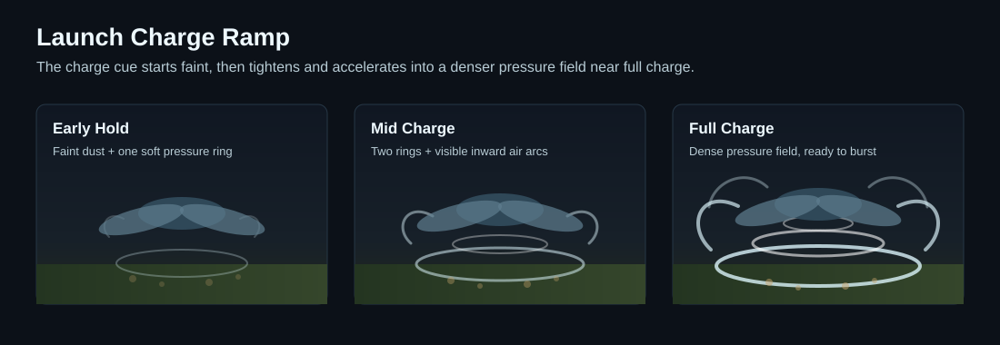

# Avatar Flight Wind VFX Design

## Purpose

Avatar flight movement already has distinct launch, flap, boost, glide, and fast-flight states. The VFX layer should make those state changes readable and satisfying without turning the transformed dragon into a magical aura effect.

The selected visual direction is wind pressure: translucent air arcs, ground rings, dust puffs, compression ripples, and thin speed lines. Effects should communicate force direction first and power level second.

## Current Context

Relevant existing behavior:

- Holding jump on the ground charges a launch. Releasing after the minimum charge applies upward and forward launch impulse.
- Left-click with Flightmaster's Reins queues an upward flap.
- Q with Flightmaster's Reins queues a forward boost.
- The movement controller already exposes one-tick output flags for `launchApplied`, `jumpApplied`, and `boostApplied`.
- Fast flight is already derived from boost-active forward flight and is visible to animation/HUD code.

This suggests a presentation layer can react to existing movement results instead of changing flight physics.

## Goals

- Add readable wind-style VFX for launch charge, launch release, flap, boost, airbrake, and high-speed flight.
- Keep VFX configurable through AvatarFlight config/assets rather than hardcoding particle IDs in controller logic.
- Expose per-effect enable toggles so modders can disable launch, flap, boost, airbrake, or trail effects independently.
- Prefer base-game particle/model attachment systems where possible.
- Keep burst effects one-shot and trails explicitly start/stop so persistent effects cannot orphan.
- Avoid noisy per-tick particle spawning unless throttled or represented as a persistent attached effect.
- Show effects to nearby players by default so AvatarFlight movement reads well in multiplayer.

## Non-Goals

- Do not rebalance AvatarFlight movement in this VFX pass.
- Do not add magical Vigour aura effects as the primary visual language.
- Do not make VFX required for movement correctness.
- Do not add broad particle infrastructure unrelated to AvatarFlight.

## Visual Direction

Selected direction: `Wind Pressure`.

The effect language should feel physical:

- launch charge: air pulls inward and dust begins circling under the dragon;
- launch release: a compressed ground ring expands outward as the dragon is pushed up;
- flap: a quick downward/upward air burst from wings and body, implying lift;
- boost: horizontal pressure streaks and a short shock-cone push behind the dragon;
- high-speed trails: thin translucent wind ribbons from model nodes while speed remains high enough for fast-flight recharge.

Color should stay mostly white, pale blue, and low-opacity grey. Dust can use warm ground tones when emitted near terrain. Avoid green/gold Vigour motes for the first version.

## Effect Concepts

Default effect concepts:

- Launch charge: inward ground-level pressure rings and dust, building smoothly as the launch hold approaches full charge.
- Launch release: one clean expanding ground shock ring plus a short upward air column to sell the stored force releasing into takeoff. Burst size/intensity should scale with final launch charge amount.
- Launch cancel: if the player releases before minimum charge, play a tiny dissipating puff so the held charge visibly fizzles without implying a successful launch. This should be its own small particle system, separate from the charge-ramp pulse system.
- Flap: brief downwash arcs from the wings/body, lighter than launch and focused on lift.
- Boost: horizontal compression streaks behind and around the dragon, stronger than flap but shorter and punchier than persistent speed trails.
- Airbrake: subtle forward-facing wind shear or compression arcs that read as drag, not as a powered burst. The primary cue is world/velocity-oriented in front of and slightly around the dragon; secondary model-attached wisps near wing/body edges keep the effect visually connected to the model.
- Fast-flight trails: thin wingtip ribbons that appear only while the dragon is at or above the fast-flight recharge speed threshold.

Flap and boost can share low-level art ingredients, such as wind textures, arc spawners, or common translucent materials. They should still be separate authored particle systems so duration, orientation, spawn shape, and intensity can differ without awkward runtime parameter branching.

Default intensity targets:

- Launch charge: starts faint and ramps to medium-high at full charge.
- Launch cancel: very low; a small dissipating cue only.
- Launch release: scales from moderate at minimum successful charge to medium-high at full charge; strong enough to mark takeoff, not a screen-filling blast.
- Flap: medium-low; readable downwash, deliberately lighter than launch or boost.
- Boost: medium-high; punchy horizontal force cue with short duration.
- Airbrake: low/subtle; enough feedback to show braking drag without visual clutter.
- Fast-flight trails: low/subtle; continuous enough to read speed, thin enough to avoid clutter.

## Configuration Direction

AvatarFlight VFX config should expose per-effect toggles in the first pass:

- `LaunchCharge.Enabled`
- `LaunchRelease.Enabled`
- `Flap.Enabled`
- `Boost.Enabled`
- `Airbrake.Enabled`
- `Trails.Enabled`

A top-level `Vfx.Enabled` kill switch is acceptable if it stays simple, but it should not replace the per-effect toggles. Each effect section should own its particle system IDs, attachment candidates, offsets, intensity/scaling knobs, and visibility mode where relevant.

## Prototype Order

Prototype launch charge and launch release first. This gives the highest player-facing payoff and validates the two hardest trigger patterns early:

- persistent ramping effect while launch is charging;
- one-shot burst effect when launch is released and successfully applied.

After that pattern is proven, extend the same presentation layer to flap and boost bursts, then fast-flight trails, then airbrake. Trails and airbrake depend more on persistent start/stop behavior and attachment fallback, so they should follow once the simpler launch path is working.

## Launch Charge Prototype

Use repeated short pulses with changing cadence and intensity for the first launch-charge prototype.

Expected behavior:

- Early charge: faint pulses around the ground/body area about every `600ms`.
- Mid charge: moderate pulses that tighten and fire about every `300ms`.
- Near full charge: medium-high pulses about every `150ms`, frequent enough to read as a continuous build-up with denser pressure rings and dust.

Pulse cadence and intensity should interpolate continuously from early to near-full charge instead of snapping at the release-tier thresholds. This approach should be robust with existing particle spawning because it does not require live parameter mutation on a persistent particle instance. It must still be throttled by charge state/time so it does not spawn particles every tick. If Hytale particle assets later support clean runtime scaling of a persistent effect, this can be revisited without changing the player-facing visual design.

## Effect Sequence Preview

The sequence preview is planning art, not a literal particle implementation. It captures the intended read:

- charge hold builds pressure below and around the body;
- launch release turns stored pressure into an expanding ground ring and upward push;
- flap shows downwash from the body and wing sweep;
- boost/trails stretch behind the model to make speed direction legible.

## Launch Charge Ramp Preview

Launch charge should ramp smoothly rather than snapping between low, medium, and high particle systems. At early hold, the effect is faint: a soft ground ring, light dust, and barely visible inward air pull. As normalized charge approaches full, rings become denser, air arcs tighten around the body, dust grows more active, and the cue becomes somewhat intense without becoming an opaque aura.

Launch release should use configurable scale/intensity tiers keyed by final charge amount. The first pass should support at least partial, mid, and full release tiers so stronger launches produce larger rings and a stronger upward air-column cue without needing a unique particle system for every possible charge value.

First-pass release VFX thresholds:

- Partial: normalized charge `0.0` to `<0.45`.
- Mid: normalized charge `0.45` to `<0.8`.
- Full: normalized charge `0.8+`.

## Attachment Node Research

Decision: support both named model nodes and fixed offsets, with node names preferred for trails and wing/body bursts. Exact node names are useful on many models, but they are not consistent enough across vanilla and HyDragon to hardcode one universal wingtip name.

Recommended shape:

- AvatarFlight VFX config should allow ordered attachment candidates per logical point, such as `LeftWingTrail`, `RightWingTrail`, `BodyCenter`, and `TailTrail`.
- Each candidate can specify `TargetNodeName` and an optional `PositionOffset`.
- Runtime should resolve and cache fallback attachments per active model/config pair. It should warn once per model when configured attachment nodes are missing, list all missing configured nodes for that model compactly, skip those candidates, and fall back to the next configured candidate or fixed offset. Missing nodes should never break AvatarFlight movement. The once-per-model warning cache should reset when relevant AvatarFlight config or model assets are reloaded.
- Tamework's default NordicDrake profile can use node names directly.
- Generic defaults should include fixed-offset fallbacks so models without predictable wing nodes still get acceptable trails.

Source-backed attachment API evidence:

- Hytale Workshop release `0.5.6`, `com.hypixel.hytale.server.core.asset.type.model.config.ModelParticle`: codec supports `TargetNodeName`, `PositionOffset`, `RotationOffset`, and `DetachedFromModel`.
- Hytale Workshop release `0.5.6`, `BuilderActionSpawnParticles#readConfig`: vanilla NPC action config reads `TargetNodeName` as the target node where particles position.
- Hytale Workshop release `0.5.6`, `ActionSpawnParticles#ActionSpawnParticles`: builds a `ModelParticle`, sets `PositionOffset`, sets `TargetNodeName`, and converts it to a model-particle packet.

Model node evidence checked:

| Source | Model path | Useful wing/trail nodes found |
| --- | --- | --- |
| Vanilla release `0.5.6` | `Common/NPC/Elemental/Dragon_Fire/Models/Model.blockymodel` | `Pelvis/Chest/L-Wing/L-Wing2/L-Wing3`, `Pelvis/Chest/R-Wing/R-Wing2/R-Wing3`; claw children exist near the distal wing chain. |
| Vanilla release `0.5.6` | `Common/NPC/Elemental/Dragon_Frost/Models/Model.blockymodel` | `Pelvis/Chest/L-Wing/L-Wing2/L-Wing3`, `Pelvis/Chest/R-Wing/R-Wing2/R-Wing3`. |
| Vanilla release `0.5.6` | `Common/NPC/Elemental/Dragon_Void/Models/Model.blockymodel` | Longer chain: `L-Wing` through `L-Wing5` and `R-Wing` through `R-Wing5`, plus wing-claw/spike nodes. |
| Vanilla release `0.5.6` | `Common/NPC/Flying_Wildlife/Hawk/Models/Model.blockymodel` | `L-Arm/L-Wing/L-Wing2`, `R-Arm/R-Wing/R-Wing2`, plus `L-Wing-Feathers`/`R-Wing-Feathers`. |
| Vanilla release `0.5.6` | `Common/NPC/Flying_Wildlife/Raven/Models/Model.blockymodel` | `L-Arm/L-Wing/L-Wing2`, `R-Arm/R-Wing/R-Wing2`, plus feather nodes. |
| Vanilla release `0.5.6` | `Common/NPC/Flying_Beast/Vulture/Models/Model.blockymodel` | `L-Wing/L-Wing2`, `R-Wing/R-Wing2`, plus feather nodes. |
| Vanilla release `0.5.6` | `Common/NPC/Flying_Beast/Pterodactyl/Models/Model.blockymodel` | Wing membrane naming differs: `L-Forearm/L-Wing/L-Wing-Flap`, `R-Forearm/R-Wing/R-Wing-Flap`. |
| Vanilla release `0.5.6` | `Common/NPC/Flying_Beast/Archaeopteryx/Models/Model.blockymodel` | Uses arm/forearm/hand feather chains rather than direct `Wing2` tip nodes. |
| HyDragon | `Common/NPC/HyDragon/NordicDrake/Model/NordicDrake.blockymodel` | `Origin/Pelvis/Belly/Chest/L-Wing/L-Wing2/L-Wing3`, `.../R-Wing/R-Wing2/R-Wing3`; also `MountAnchor`. |
| HyDragon | `Common/NPC/HyDragon/GhoulDragon/Model/GhoulDragon.blockymodel` | `L-Wing/L-Wing2`, `R-Wing/R-Wing2`. |
| HyDragon | `Common/NPC/HyDragon/Wyvern_Wild/Model/Wyvern_Wild.blockymodel` | Uses underscore naming: `L_Wing`, `R_Wing`, `R_Wing/R_Wing2`. |
| HyDragon | `Common/NPC/HyDragon/Wyvern_Mini/Model/Wyvern_Mini.blockymodel` | Uses non-English wing names: `Asa E/Asa E2` and `Asa D/Asa D2`. |

Inference: named-node attachment is appropriate for curated AvatarFlight profiles, especially NordicDrake and vanilla-style dragons. A generic Tamework feature should not require every model to follow `L-Wing3`/`R-Wing3`; it should support aliases/candidates and offset fallback.

## Initial Trigger Model

Use these trigger patterns:

- Launch charge: persistent cue while grounded launch hold is active, with intensity driven by normalized hold duration. The effect should ramp smoothly from faint to somewhat intense as charge approaches full.
- Launch cancel: tiny one-shot dissipating puff when launch hold releases below the minimum charge and no launch is applied.
- Launch release: one-shot state-entry burst when `launchApplied` is true.
- Flap: one-shot burst when `jumpApplied` is true.
- Boost: one-shot burst when `boostApplied` is true, with optional short follow-through during the active boost window.
- Airbrake: subtle cue while airbrake is actively held, throttled or persistent so it does not spawn a burst every tick. It should combine a low-intensity forward compression/shear cue with very light model-attached wisps.
- Fast-flight trails: persistent cue while the player is moving fast enough to qualify for fast-flight recharge, whether that speed comes from Q boost, diving, or clean high-speed gliding. Trails should prefer model-node attachments at left/right distal wing points, with fixed-offset fallback. Trails need a clear stop path when speed falls below threshold or AvatarFlight exits.

The implementation should avoid embedding particle spawning directly in `AvatarFlightController`, which is currently pure velocity logic. A dedicated AvatarFlight VFX/presentation service should consume controller output from the movement system or a nearby orchestration point.

Default visibility should be all nearby players. The config can still expose an owner-only or disabled visibility mode later, but the baseline Tamework default should make flight actions readable to other players in the area.

## Open Questions

- Should the smooth launch-charge ramp be implemented as one parameterized persistent effect, repeated short pulses with changing cadence, or a small set of blended particle layers?
- Should launch effects include matching sound hooks in the first VFX pass, or stay particle-only for now?

## Testing and Validation Notes

Expected validation once implemented:

- Verify each configured particle path resolves and has no orphan trigger hook.
- Verify launch charge effects stop on launch, cancel, landing-state loss, and AvatarFlight disable.
- Verify burst effects fire once per successful movement action, not every tick while an input is held.
- Verify trails stop when the player slows, lands, disables AvatarFlight, disconnects, or changes model.
- Verify missing configured attachment nodes fail gracefully, emit only one compact warning per model listing all missing configured nodes, and fall back to the next attachment candidate or offset.
- Run `./mvnw test` after Java changes.

## Decision Log

- 2026-07-07: Chose `Wind Pressure` as the primary visual direction over Vigour-energy or hybrid magical effects.
- 2026-07-07: Decided to maintain this document as a living spec while brainstorming and implementation decisions are made.
- 2026-07-07: Decided high-speed trails should appear whenever the dragon qualifies for fast-flight recharge, including boost, diving, and fast gliding.
- 2026-07-07: Decided AvatarFlight wind effects should be visible to all nearby players by default.
- 2026-07-07: Decided launch charge should use a smooth intensity ramp that starts faint and builds to a somewhat intense wind-pressure cue at full charge.
- 2026-07-07: After checking vanilla release `0.5.6` dragon/bird models and HyDragon dragon models, decided trails should support both named model nodes and fixed offsets. Node names are preferred for curated profiles; offsets are the generic fallback.
- 2026-07-07: Decided runtime should warn on missing configured attachment nodes, fail gracefully, and fall back to the next candidate or fixed offset.
- 2026-07-07: Decided missing attachment-node warnings should be emitted only once per model to avoid log spam.
- 2026-07-07: Decided the once-per-model warning should list all missing configured nodes for that model.
- 2026-07-07: Decided the missing-node warning cache should reset when relevant AvatarFlight config or model assets are reloaded.
- 2026-07-07: Decided fallback attachment resolution should be cached per active model/config pair.
- 2026-07-07: Decided to stop drilling into attachment implementation details for now and refocus the spec on the effect designs themselves.
- 2026-07-07: Accepted the default effect concepts: smooth inward launch charge, launch shock ring plus upward air column, light flap downwash, punchy horizontal boost streaks, and thin fast-flight wingtip trails.
- 2026-07-07: Decided flap and boost may share art ingredients but should be separate authored particle systems.
- 2026-07-07: Accepted default intensity targets: launch charge faint-to-medium-high, launch release medium-high, flap medium-low, boost medium-high, and fast-flight trails low/subtle.
- 2026-07-07: Decided airbrake should receive a first-pass subtle wind-shear cue at low intensity.
- 2026-07-07: Decided airbrake should use both a primary world/velocity-oriented compression cue and secondary subtle model-attached wisps.
- 2026-07-07: Decided first-pass config should expose per-effect enable toggles.
- 2026-07-07: Decided launch charge/release should be prototyped first, before flap/boost, trails, and airbrake.
- 2026-07-07: Decided the first launch-charge prototype should use repeated short pulses with increasing cadence and intensity.
- 2026-07-07: Accepted first-pass launch-charge pulse cadence targets: about `600ms` early, `300ms` mid, and `150ms` near full charge.
- 2026-07-07: Decided the launch release burst should scale with final charge amount.
- 2026-07-07: Decided launch release scaling should use configurable scale/intensity tiers, with partial/mid/full as the first-pass tier shape.
- 2026-07-07: Accepted first-pass release VFX thresholds: partial `<0.45`, mid `0.45` to `<0.8`, full `0.8+`.
- 2026-07-07: Decided launch-charge pulse cadence and intensity should interpolate continuously instead of snapping to release-tier thresholds.
- 2026-07-07: Decided canceled pre-minimum launch releases should play a tiny dissipating puff.
- 2026-07-07: Decided launch cancel should use its own tiny particle system rather than reusing the charge-ramp pulse system.
